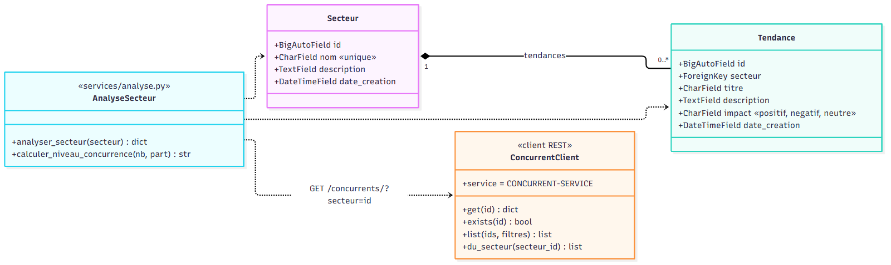
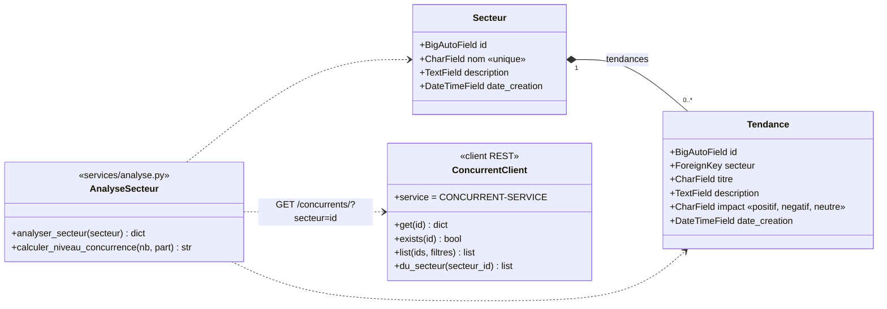

# Diagramme de classes — secteur-service

Base `secteur_db`. `Tendance` garde une clé étrangère vers `Secteur` (même service).

```mermaid
classDiagram
    direction LR
    class Secteur {
        +BigAutoField id
        +CharField nom «unique»
        +TextField description
        +DateTimeField date_creation
    }
    class Tendance {
        +BigAutoField id
        +ForeignKey secteur
        +CharField titre
        +TextField description
        +CharField impact «positif, negatif, neutre»
        +DateTimeField date_creation
    }
    class ConcurrentClient {
        <<client REST>>
        +service = CONCURRENT-SERVICE
        +get(id) dict
        +exists(id) bool
        +list(ids, filtres) list
        +du_secteur(secteur_id) list
    }
    class AnalyseSecteur {
        <<services/analyse.py>>
        +analyser_secteur(secteur) dict
        +calculer_niveau_concurrence(nb, part) str
    }
    Secteur "1" *-- "0..*" Tendance : tendances
    AnalyseSecteur ..> Secteur
    AnalyseSecteur ..> Tendance
    AnalyseSecteur ..> ConcurrentClient : GET /concurrents/?secteur=id
```
