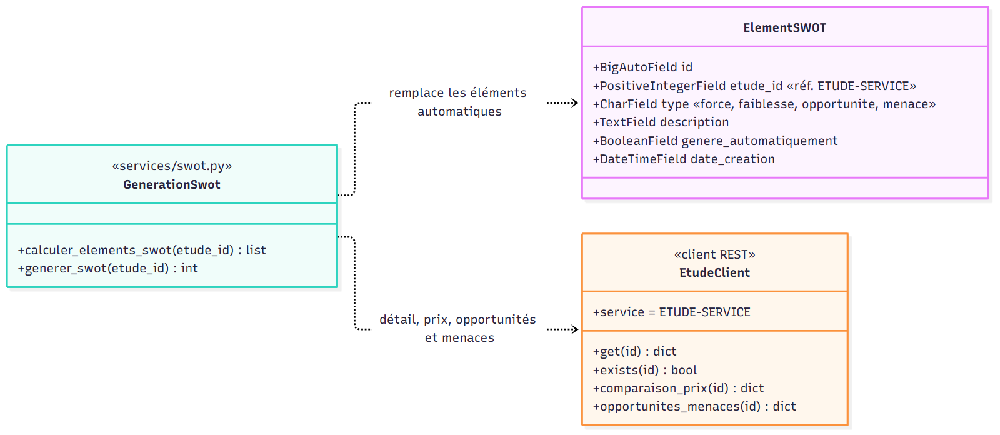
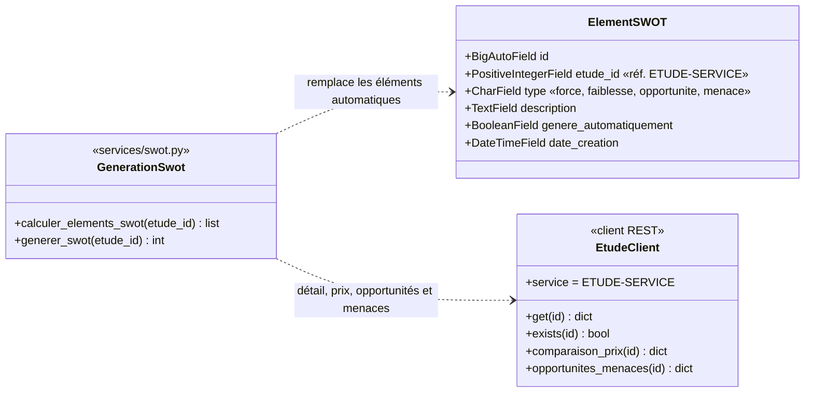

# Diagramme de classes — swot-service

Base `swot_db`. L'étude n'est plus une clé étrangère : `etude_id` est vérifié, et les données de
l'étude sont lues sur ETUDE-SERVICE par `EtudeClient`.

```mermaid
classDiagram
    direction LR
    class ElementSWOT {
        +BigAutoField id
        +PositiveIntegerField etude_id «réf. ETUDE-SERVICE»
        +CharField type «force, faiblesse, opportunite, menace»
        +TextField description
        +BooleanField genere_automatiquement
        +DateTimeField date_creation
    }
    class GenerationSwot {
        <<services/swot.py>>
        +calculer_elements_swot(etude_id) list
        +generer_swot(etude_id) int
    }
    class EtudeClient {
        <<client REST>>
        +service = ETUDE-SERVICE
        +get(id) dict
        +exists(id) bool
        +comparaison_prix(id) dict
        +opportunites_menaces(id) dict
    }
    GenerationSwot ..> ElementSWOT : remplace les éléments automatiques
    GenerationSwot ..> EtudeClient : détail, prix, opportunités et menaces
```
